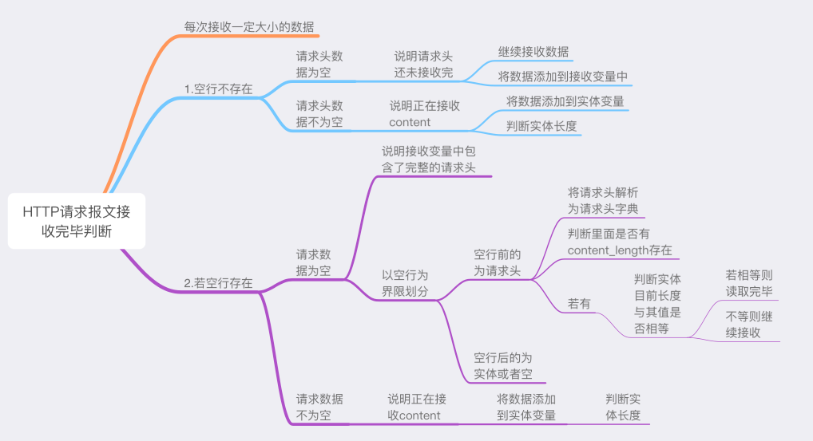

# 1. 目的

使用python实现HTTP请求报文是否结束的判断。

# 2. 项目意义

- 理解socket通信中的接收`recv`字节数大小
- 掌握HTTP协议报文格式
- 完善web服务器的请求信息解析
- 实现返回页面显示请求信息

# 3. 项目技术要点

- 基于python3.6语言编写
- 此项目通过`mini_web.py`来实现web服务器解析请求信息功能
- `request_end`方法实现请求报文解析和结束判断
- `deal_with_request`实现返回页面显示请求信息
- 请求信息同步打印显示在终端窗口
- 默认测试地址`localhost:8888`

# 4. 技术细节

- 服务器类基本功能实现：
  - 初始化功能`__init__`
    - 创建服务器端套接字、绑定端口、监听设置等一系列操作`socket`
  - 永久启动功能`run_forvever`
    - 接收客户端请求后通过协程来建立调用浏览器请求处理措施
  - `_request_end`判断并解析请求数据
  - 浏览器请求处理`deal_with_request`
    - 接收解析信息，并将相关内容返回给浏览器以显示

- _request_end方法的处理逻辑

